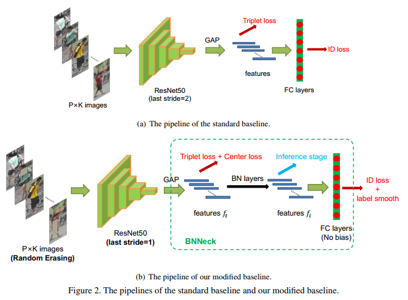
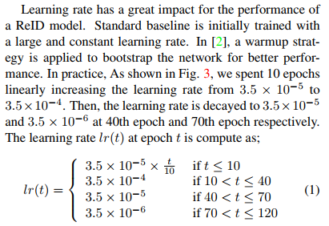

 Inaddition,we also found that some works were unfairly compared with other state-of-the-arts methods. Specifically, the improvements were mainly from training tricks rather than methods themselves. But the training tricks were understated in the paper so that readers ignored them .

 it would make the effectiveness of the method exaggerated. We suggest that reviewers need to take into account these tricks when commenting academic papers. 

 此外，我们还发现，一些作品与其他先进的方法相比是不公平的。具体来说，这些改进主要来自训练技巧，而不是方法本身。但训练技巧在paper上被低估了，所以读者忽略了它们 

 这将使该方法的有效性被夸大。我们建议审稿人在评论学术论文时考虑这些技巧。 

 Apart from aforementioned reasons, another consideration is that the industry prefers to simple and effective models rather than **concatenating** lots of local features in the inference stage. In pursuit of high accuracy,researchers in the academic always combine several local features or utilize the semantic information from pose estimation or segmentation models. Such methods bring too much extra consumption. Large features also greatly reduce the speed of retrieval process. Thus, we hope to use some tricks to improve the ability of the ReID model and only use global features to achieve high performance. The purposes of this paper are summarized as follow :

 除了上述原因，另一个需要考虑的是，该行业更喜欢简单、高效的模型，而不是在推理过程中**串联**大量的本地特征。为了获得较高的精度，学者们通常会结合局部特征或利用姿态估计或分割模型中的语义信息。这些方法带来了太多的额外消耗。大的特征也大大降低了检索的速度。因此，我们希望使用一些技巧来提高ReID模型的能力，并且只使用全局特性来实现高性能。本文的研究目的如下

这块我没翻译

 Moreover, we found different works choose different image sizes and numbers of batch size, as a supplement, we also explore their impacts on model performance. In summary, the contributions of this paper are concluded as follow 

 此外，我们发现不同的作品选择不同的图像尺寸和批量大小，作为补充，我们也探讨了它们对模型性能的影响。综上所述，本文的贡献总结如下 

### 创新点

1.  We collect some effective training tricks for person ReID. Among them, we design a new neck structure named as BNNeck. In addition, we evaluate the improvements from each trick on two widely used datasets 
2.  We provide a strong ReID baseline, which achieves 94.5% and 85.9% mAP on Market1501 。 it is worth mentioned that the results are obtained with global features provided by ResNet50 backbone. To our best knowledge, it is the best performance acquired by global features in person ReID. 
3.  Asasupplement,we evaluate the influences of the image size and the number of batch size on the performance of ReID models 

1. 我们为ReID收集了一些有效的训练技巧。其中，我们设计了一种新的颈部结构，命名为BNNeck。另外，我们在两个广泛使用的数据集上评估每个技巧的改进 
2.  我们提供了一个强大的ReID基线，在Market1501上实现了94.5%和85.9%的映射 。 值得一提的是，这些结果是由ResNet50主干网提供的全局特征得到的。据我们所知，它是global features所获得的最佳性能person ReID。 
3.  最后，我们评估了图像大小和batch size 的数量对ReID模型性能的影响 

1. 我们为学术界和工业界提供强大而简单的ReID基线；
2. 我们收集并评估了Market1501和DukeMTMC-reID数据集上的一些训练技巧；
3. 我们观察到ID丢失和三联体丢失之间的不一致，并提出了一种名为BNNeck的新型结构；
4. 我们观察到ReID任务忽略了类内紧凑性和类间可分性，并且证明中心丢失可以弥补它。

 **Standard Baseline:** 

 We follow a widely used open-source as our standard baseline. The backbone(主干，骨骼) of the standard baseline is ResNet50. During the training stage, the pipeline includes following steps ：

1. We initialize the ResNet50 with pre-trained parameters on ImageNet and change the dimension of the fully connected layer to N. N denotes the number of identities in the training dataset.
2. We randomly sample P identities and K images of per person to constitute a training batch. Finally the batch size equals to B = PK. In this paper, we set P = 16 and K = 4.
3. We resize each image into 256 128 pixels and pad the resized image 10 pixels with zero values. Then randomly crop it into a 256 128 rectangular image.
4. Each image is flipped horizontally with 0.5 probability.
5. Each image is decoded into 32-bit floating point raw pixel values in [0; 1]. Then we normalize RGB channels by subtracting 0.485, 0.456, 0.406 and dividing by 0.229, 0.224, 0.225, respectively.
6. The model outputs ReID features f and ID prediction logits p.
7. ReID features f is used to calculate triplet loss [6]. ID prediction logits p is used to calculated cross entropy loss. The margin m of triplet loss is set to be 0.3.
8. Adam method is adopted to optimize the model. The initial learning rate is set to be 0.00035 and is decreased by 0.1 at the 40th epoch and 70th epoch respectively. Totally there are 120 training epochs.

1. 我们在ImageNet上初始化带有预训练参数的ResNet50，并将全连接层的维数更改为N。N表示训练数据集中的身份数。
2. 我们随机抽取每个人的P个身份和K个图像作为训练样本。最后批处理大小为B = PK，本文令P = 16, K = 4。
3. 我们将每个图像的大小调整为256 128像素，并将调整后的图像填充为10像素，并设置零值。然后随机裁剪成一个256 128矩形图像。
4. 每幅图像水平翻转的概率为0.5。
5. 每个图像被解码成32位浮点原始像素值在[0;1]。然后分别减去0.485、0.456、0.406，再除以0.229、0.224、0.225，对RGB通道进行归一化处理。
6. 模型输出ReID特征f和ID预测  分对数p。
7. ReID 特征 f 用于计算triplet loss [6]。利用ID预测 logits p计算交叉熵损失。triplet loss 的 margin m设定为0.3。
8. 采用Adam法对模型进行优化。初始学习率设定为0.00035，第40期和第70期分别降低0.1。总共有120个训练期。

### 3.培训技巧（training Tricks）

This section will introduce some effective training tricks in person ReID. Most of such tricks can be expanded on the standard baseline without changing the model architecture. The Fig. 2 (b) shows training strategies and the model architecture appeared in this section.

本节将介绍一些有效的训练技巧。大多数这样的技巧可以在标准基线上扩展，而不需要改变模型架构。图2 (b)为本节中出现的训练策略和模型架构。

**3.1.Warmup Learning Rate**

学习率对ReID模型的性能有很大的影响。标准基线最初以较大且恒定的学习率进行训练。在[2]中，使用预热策略引导网络以获得更好的性能。在实践中，如fig 3所示，我们花费了10个epoch，将学习率从3.5x10e-5线性增加到3.5x10e-4。然后分别在第40元和第70元将学习率衰减为3.5x10e-5和3.5x10e- 6。历元t的学习速率lr(t)计算为

**3.2. Random Erasing Augmentation (随机擦除增强)**

 在行人重识别时，有时会被其他物体遮挡。为了解决遮挡问题，提高ReID模型的泛化能力，Zhong等人提出了一种新的数据增强方法——随机消除增强(REA)。  在实践中，对于一个小批量的图像 I，随机擦除的概率为pe，保持不变的概率为1 - pe。然后，REA 在图像 I 中随机选择一个大小为(We, He)的矩形区域，并用随机值擦除其像素 . 假设图像I和区域 Ie 的面积分别为S = W * H和Se = We * He，我们将re = Se/S表示为擦除矩形区域的面积比。另外，区域 Ie 的长宽比在r1和r2之间随机初始化。为了确定一个唯一的区域，REA随机初始化一个点P = (xe, ye)。如果xe + We <= W和ye + He <= H，我们将区域Ie = (xe, ye, xe + We, ye + He)设置为选定的矩形区域。否则，我们重复上述过程，直到一个适当的 Ie 被选择。  在选定的消除区域Ie中，Ie中的每个像素分别赋给图像I的均值。在本研究中，我们分别将hyper参数设置为p = 0.5, 0.02 <Se < 0.4, r1 = 0.3, r2 = 3.33。一些例子如图4所示。 

**3.3 Label Smooting (标签平滑)**

 ID嵌入(IDE)[25]网络是person ReID的基本基线。IDE的最后一层,输出的ID预测分对数图像,是一个全层隐藏大小等于数字的人N .给定一个图像,我们表示y作为真实ID标签, pi 为第 i 类的 ID 预测的 对数。交叉熵损失计算 如下

 由于分类的类别是由人的ID来决定的，所以我们将这种损失函数称为ID损失。然而，由于测试集的人id没有出现在训练集中，所以可以将person ReID视为一次性学习任务，因此防止ReID模型对训练id进行过拟合非常重要。在[17]中提出的标签平滑(LS)是一种广泛用于防止分类任务过拟合的方法。它改变了 qi 的结构 

 ε的地方是一个小的常数鼓励模型训练集上的缺乏置信度。在这项研究中,ε将是0.1。当训练集不是很大时，LS可以显著提高模型的性能。 

 **3.4. Last Stride（最后一步）**

 

 更高的空间分辨率通常会丰富特征的粒度。在[16]中，Sun等人删除了主干网络中的最后一次空间下采样操作，以增加feature map的大小。为了方便起见，我们将骨干网络中的最后一次空间下采样操作称为最后一步。ResNet50的最后一步设置为2。当输入一个大小为256*128的图像时，ResNet50的主干输出一个空间大小为8 * 4的feature map。如果将最后一步由2步变为1步，我们可以得到一个空间尺寸更大的feature map(16 * 8)，这种操作只会增加非常小的计算量，并且不需要额外的训练参数。然而，更高的空间分辨率带来了显著的改善。 

 **3.5. BNNeck** 

 大部分工作都是将ID丢失和三重丢失结合起来训练ReID模型。如图5(a)所示，在标准基线中，ID丢失和三重态丢失约束了相同的特征f。但是，这两个丢失的目标在嵌入空间上是不一致的。如图6(a)所示，ID丢失构造多个超平面，将嵌入空间划分为不同的子空间。每个类的特性分布在不同的子空间中。在这种情况下，对于推理阶段的ID丢失优化模型，余弦距离比欧几里德距离更合适。另一方面，如6(b)所示 

 triplet-loss三重态损失增强了欧氏空间的类内紧性和类间可分性。由于三重态损失不能提供全局最优约束，类间距离有时小于类内距离。一种广泛使用的方法是将身份损失和三重损失结合起来训练模型。这种方法使模型学习到更多的区别性特征。而对于嵌入空间中的图像对，ID损失主要优化余弦距离，triplet-loss主要优化欧氏距离。如果我们使用这两个损失同时优化一个特征向量，它们的目标可能是不一致的。在训练过程中，一个可能的现象是一个损失减少了，而另一个损失却在振荡甚至增加。
为了解决上述问题，我们设计了如图5(b)所示的BNNeck结构。BNNeck只在特征之后(在分类器FC层之前)添加了一个batch normalization (BN)层。BN层之前的特征记作 ft，我们让 ft 通过 BN 层获得归一化特征 fi。在训练阶段，ft 和 f 分别用于计算三重态损耗和ID损耗。归一化平衡了fi的各个维度。超球面的特征是高斯分布的。这种分布使得ID丢失更容易收敛。此外，BNNeck还减少了ID损失对 ft 的约束，较少的ID损失约束使三重损失同时更容易收敛。第三，归一化保持了属于同一人的特征的紧凑分布。 
由于超球面与坐标轴的原点几乎是对称的，所以BNNeck的另一个技巧是消除分级器FC层的偏差。它约束分类超平面通过坐标轴的原点。我们用[4]中提出的 kaiming 初始化来初始化FC层。

在推理阶段，我们选择fi来完成person ReID任务。余弦距离度量比欧几里德距离度量具有更好的性能。实验结果如表1所示，BNNeck可以大幅度提高ReID模型的性能。  

 **3.6. Center Loss ( 中心损失)** 

 Triplet loss is computed as: 

 其中dp和dn是正对和负对的特征距离。α是三个一组的保证金损失,和[z]+ 等价于 max (z, 0), α设置为0.3。然而，三重损耗只考虑dp和dn之间的差异，而忽略了它们的绝对值。例如，当dp = 0.3, dn = 0.5时，三重损耗为0.1。另一种情况下，当dp = 1.3, dn = 1.5时，三重损耗也是0.1。三重态损耗是由两个随机采样的人的id决定的。很难保证在整个训练数据集中dp < dn。
中心丢失[20]同时学习每个类的深度特征中心，并惩罚深度特征与其对应的类中心之间的距离，弥补了三重丢失的缺点。中心损失函数表示为 

 其中 yj 是小批量处理中的第 j 个图像的标签。 cyj 表示深部特征的第一类中心。B是批量大小的数量。这个公式有效地描述了阶级内部的变化。最小化中心损失可以增加类内的紧凑性。我们的模型总共包括以下三个损失 ：

 β是中心的平衡重量损失。在我们的实验中,β将0.0005。 

**4. Experimental Results** 

 在本节中，我们将在Market1501和DukeMTMC-reID[11]数据集上评估我们的模型。以Rank1精度和平均精度(mAP)作为评价指标。我们依次在标准基线上添加技巧，并且不改变任何训练设置。消融研究的结果显示了每个技巧的性能提升。为了避免过拟合的误导，我们还展示了跨域实验的结果。 

 **4.1. Influences of Each Trick (Same domain)** 

 The standard baseline introduced in section 2 achieves 87.7% and 79.7% rank-1 accuracies on Market1501 and DukeMTMC-reID, respectively. The performance of standard baseline is similar with most of baselines reported in other papers. Then, we add warmup strategy, random erasing augmentation, label smoothing, stride change, BNNeck and center loss to the model training process, one by one. Our designed BNNeck boosts more performance than other tricks, especially on DukeMTMC-reID. Finally, these tricks make baseline acquire 94.5% rank-1 accuracy and 85.9% mAP on Market1501. On DukeMTMC-reID, it reaches 86.4% rank-1 accuracy and 76.4% mAP. In other works, these training tricks boost the performance of the standard baseline by more than 10% mAP. In addition, to get such improvement, we only involve an extra BN layer and do not increase training time. 

 第2节中引入的标准基线对Market1501和DukeMTMC-reID的秩-1精度分别达到87.7%和79.7%。标准基线的性能与其他文献报道的大多数基线相似。然后，我们将热身策略、随机消除增强、标签平滑、步幅变化、BNNeck和中心损失一个接一个地加入到模型训练过程中。我们设计的BNNeck比其他技巧提高更多的性能，特别是在DukeMTMC-reID上。最后，这些技巧使基线获得94.5%的排名-1精度和85.9%的市场地图1501。在DukeMTMC-reID上，其秩1正确率为86.4%，地图正确率为76.4%。在其他工作中，这些训练技巧将标准基线的性能提高了10%以上。另外，为了得到这样的改善，我们只涉及额外的BN层，不增加训练时间。 

 **4.2. Analysis of BNNeck**  

 在本节中，我们使用欧氏距离度量和余弦距离度量来评估两个不同特征(ft和fi)的性能。表2所有模型均经过训练，无中心损失。我们观察到，在ft中，余弦距离度量比欧几里德距离度量表现得更好。由于ID损失直接限制了BN层之后的特征，fi可以被多个超平面清晰地分割。余弦距离可以度量两个特征向量之间的夹角，因此余弦距离度量比欧几里得距离度量更适合用于fi，但是ft更接近于三重损失，同时也受到ID损失的限制。两种指标对ft的性能基本相同。总体而言，BNNeck显著提高了ReID模型的性能。在推理阶段，我们选择带余弦距离度量的fi进行检索。 

 **4.3.   Influences of Each Trick (Cross domain)  每一trick的影响(跨域)** 

 为了进一步探讨其有效性，我们还将跨域实验结果如表3所示。综上所述，热身策略、标签平滑和BNNeck三种技巧显著提高了ReID模型的跨域性能。步幅的变化和中锋的损失似乎对表现没有太大的影响。然而，在跨域ReID任务中，REA对模型有一定的危害。特别是，当我们的修改基线在没有REA的情况下进行训练时，它在Market1501和DukeMTMC-reID数据集上的排名-1正确率分别达到41.4%和54.3%。它的性能大大超过了标准基线的性能。我们推断，REA掩盖训练图像的区域可以让模型在训练领域学到更多的知识。它会导致模型在测试领域的表现变差 .

 **4.4. Comparison of State-of-the-Arts**  

 我们比较了强基线与最先进的方法在表4。所有的方法都被分成不同的类型。pyramid[22]实现了两个数据集的惊人性能。但是，它连接了21个不同尺度的局部特征。若仅利用全球特征，则可获得92.8%的rank-1精度和82.1%的market - 1501 mAp 。我们的强大基线可以达到94.5%的rank1精度和85.9%的市场地图1501。BFE[1]的性能与我们的强基线类似。但是它结合了两个分支的特性。在所有只使用全局特性的方法中，我们的强基线在 Market1501 和DukeMTMC-reID 上都比 AWTL[12] 强10%以上。通过k- reciprocal （倒数k个）重链方法来提高性能，我们的方法在Market1501和DukeMTMC-reID上分别达到了94.1%和89.1%的mAP。据我们所知，在仅使用全局特性的情况下，我们的基线实现了最佳性能。 

**5.  Supplementary Experiments  补充实验** 

 我们观察到之前的一些工作是用不同数量的批大小或图像大小完成的。在本节中，作为补充，我们将探讨它们对模型性能的影响。 

 **5.1. Influences of the Number of Batch Size（ 影响批量大小的因素 ）** 

 小批量的三重态损失 包括B = P * K个图像。P和K分别表示每个人的不同数量和不同图像的数量。一个小批处理在一个GPU中最多只能包含128张图像，因此我们不能在P = 32。 K = 6或P = 32。 K = 8的情况下进行实验。我们移除了中心损失，以清楚地找出三重损失与批次大小之间的关系。结果见表5。但是，目前还没有具体的结论来说明B对性能的影响。我们观察到的一个轻微的趋势是，更大的批大小有利于模型的性能。我们推断，大K有助于挖掘硬阳性对，而大P有助于挖掘难的负类对。 

 **5.2. Influences of Image Size** 

 我们训练了无中心损失的模型，令P = 16, K = 4。如表6所示，四个模型在两个数据集上实现了类似的性能。在我们看来，图像大小并不是ReID模型性能的一个非常重要的因素。 

**6. Conclusions and Outlooks（结论和展望）** 

 在本文中，我们收集了一些有效的训练技巧，并为ReID设计了一个强基线。为了证明每种技巧对ReID模型性能的影响，我们在相同的域和跨域ReID任务上做了大量的实验。最后，仅使用全球功能，我们的强大基线实现了94.5%的排名-1的准确性和85.9%的市场地图1501。我们希望这项工作能够促进ReID在学术界和工业界的研究。然而，我们工作的目的不是粗略地提高性能。与人脸识别相比，人里德还有很长的路要走。我们认为一些训练技巧可以加速探索，还有很多有效的技巧没有被发现。我们欢迎研究人员与我们分享一些其他有效的技巧。今后我们将根据这项工作对它们进行评估 。

 References 

